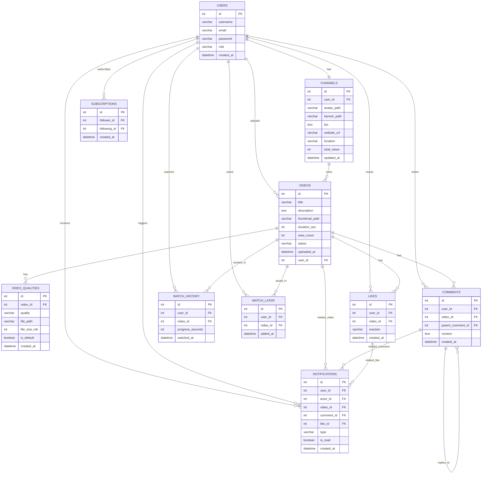

```mermaid
erDiagram

  USERS {
    int id PK
    varchar username
    varchar email
    varchar password
    varchar role
    datetime created_at
  }

  CHANNELS {
    int id PK
    int user_id FK
    varchar avatar_path
    varchar banner_path
    text bio
    varchar website_url
    varchar location
    int total_views
    datetime updated_at
  }

  VIDEOS {
    int id PK
    varchar title
    text description
    varchar thumbnail_path
    int duration_sec
    int view_count
    varchar status
    datetime uploaded_at
    int user_id FK
  }

  VIDEO_QUALITIES {
    int id PK
    int video_id FK
    varchar quality
    varchar file_path
    int file_size_mb
    boolean is_default
    datetime created_at
  }

  LIKES {
    int id PK
    int user_id FK
    int video_id FK
    varchar reaction
    datetime created_at
  }

  COMMENTS {
    int id PK
    int user_id FK
    int video_id FK
    int parent_comment_id FK
    text content
    datetime created_at
  }

  WATCH_HISTORY {
    int id PK
    int user_id FK
    int video_id FK
    int progress_seconds
    datetime watched_at
  }

  WATCH_LATER {
    int id PK
    int user_id FK
    int video_id FK
    datetime added_at
  }

  SUBSCRIPTIONS {
    int id PK
    int follower_id FK
    int following_id FK
    datetime created_at
  }

  NOTIFICATIONS {
    int id PK
    int user_id FK
    int actor_id FK
    int video_id FK
    int comment_id FK
    int like_id FK
    varchar type
    boolean is_read
    datetime created_at
  }

  USERS ||--|| CHANNELS : has
  USERS ||--o{ VIDEOS : uploads
  USERS ||--o{ LIKES : reacts
  USERS ||--o{ COMMENTS : writes
  USERS ||--o{ WATCH_HISTORY : watches
  USERS ||--o{ WATCH_LATER : saves
  USERS ||--o{ NOTIFICATIONS : receives
  USERS ||--o{ NOTIFICATIONS : triggers
  USERS ||--o{ SUBSCRIPTIONS : subscribes

  CHANNELS ||--o{ VIDEOS : owns

  VIDEOS ||--o{ VIDEO_QUALITIES : has
  VIDEOS ||--o{ LIKES : has
  VIDEOS ||--o{ COMMENTS : has
  VIDEOS ||--o{ WATCH_HISTORY : tracked_in
  VIDEOS ||--o{ WATCH_LATER : saved_in
  VIDEOS ||--o{ NOTIFICATIONS : related_video

  COMMENTS ||--o{ COMMENTS : replies_to
  COMMENTS ||--o{ NOTIFICATIONS : related_comment

  LIKES ||--o{ NOTIFICATIONS : related_like


```

